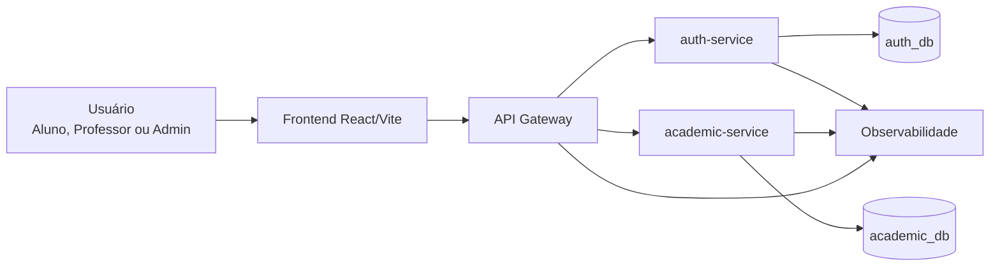
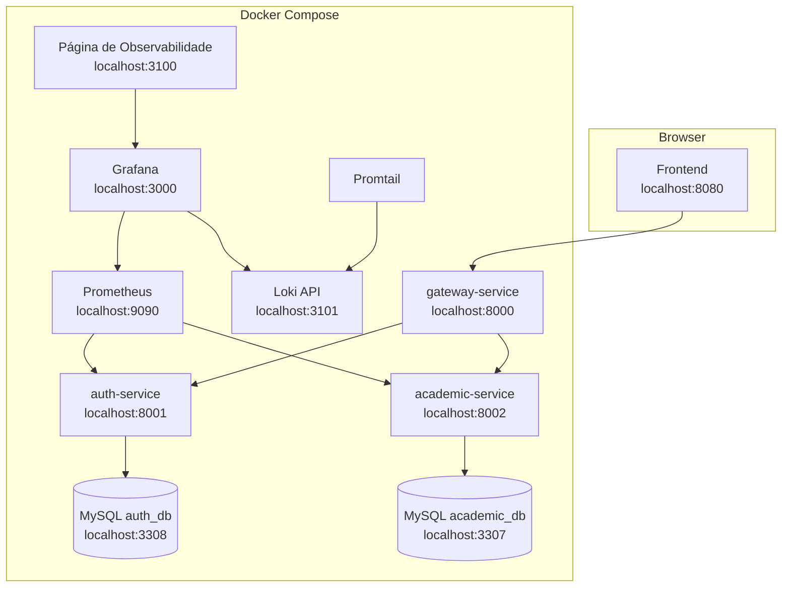
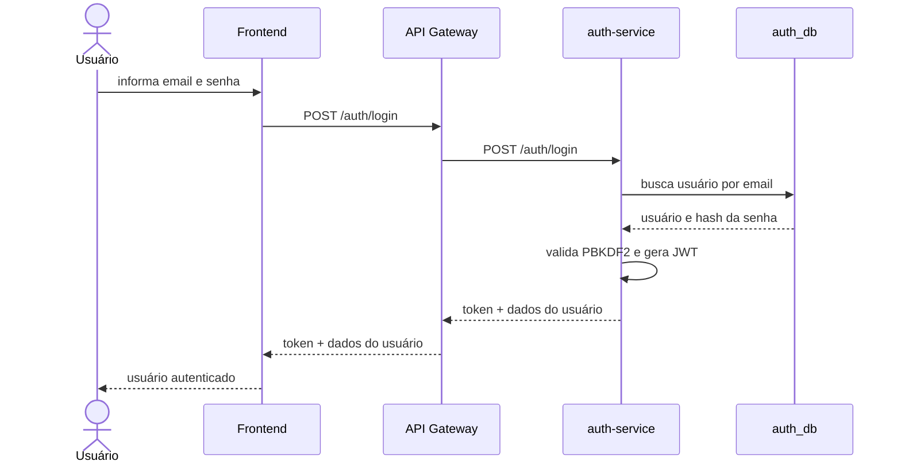
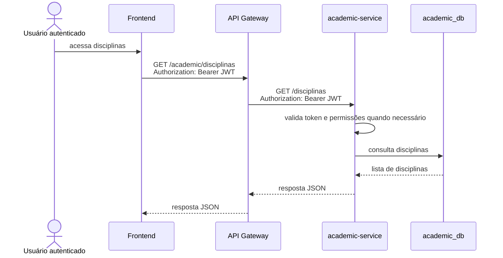

# Arquitetura

## Visão Geral

A Plataforma de Gerenciamento Acadêmico foi projetada como uma aplicação baseada em microsserviços. A separação dos domínios reduz acoplamento, facilita manutenção independente e permite que cada serviço evolua, escale e seja implantado de forma isolada.

O sistema possui quatro blocos principais:

- Frontend React/Vite para interação dos usuários.
- API Gateway como ponto único de entrada HTTP.
- Microsserviços de domínio em FastAPI.
- Infraestrutura de dados e observabilidade em containers.

## Por Que Microsserviços

A arquitetura em microsserviços foi escolhida porque o domínio possui responsabilidades bem separadas:

- Autenticação e usuários mudam por motivos diferentes das regras acadêmicas.
- Dados sensíveis de usuários ficam isolados no `auth-service`.
- Regras acadêmicas ficam concentradas no `academic-service`.
- O `gateway-service` centraliza o acesso externo sem duplicar regras de negócio.

Esse modelo também combina com o objetivo DevOps do projeto, pois cada serviço possui seu próprio `DockerFile`, dependências e ciclo de build.

## Responsabilidades Dos Serviços

### Frontend

Aplicação web em React/Vite. Consome a API através do API Gateway em `http://localhost:8000`.

Responsabilidades:

- Tela de login.
- Navegação entre dashboards, disciplinas, turmas, atividades e entregas.
- Armazenamento local do token JWT.
- Envio do header `Authorization: Bearer <token>`.

### gateway-service

Ponto único de entrada da API para o navegador.

Responsabilidades:

- Expor `http://localhost:8000`.
- Aplicar CORS na borda.
- Encaminhar `/auth/*` para o `auth-service`.
- Encaminhar `/academic/*` para o `academic-service`.
- Repassar headers de autenticação.
- Expor `/health`.
- Emitir logs básicos de requisição.

O gateway não possui regras de negócio acadêmicas nem regras de autenticação. Ele apenas roteia chamadas.

### auth-service

Serviço responsável por identidade e autenticação.

Responsabilidades:

- Gerenciar usuários.
- Validar credenciais.
- Armazenar senhas com hash PBKDF2.
- Emitir tokens JWT.
- Validar usuário autenticado via `/auth/me`.
- Expor dados básicos de usuário para integração.

Banco de dados próprio: `auth_db`.

### academic-service

Serviço responsável pelo domínio acadêmico.

Responsabilidades:

- Listar disciplinas.
- Listar e detalhar turmas.
- Criar atividades.
- Registrar entregas.
- Atribuir notas.
- Validar permissões por perfil usando JWT.
- Consultar o `auth-service` quando necessário para validação integrada.

Banco de dados próprio: `academic_db`.

### Bancos De Dados

O projeto usa MySQL 8.0 com separação por domínio:

| Banco | Dono | Conteúdo |
| --- | --- | --- |
| `auth_db` | `auth-service` | usuários, credenciais e perfis |
| `academic_db` | `academic-service` | disciplinas, turmas, alunos, professores, atividades, entregas e notas |

Cada microsserviço acessa somente seu próprio banco.

### Stack De Observabilidade

Responsabilidades:

- Prometheus coleta métricas dos serviços.
- Grafana exibe dashboards e logs.
- Loki armazena logs centralizados.
- Promtail coleta logs dos containers Docker.
- `observability-home` fornece uma página inicial em `http://localhost:3100`.

## Fluxo De Autenticação Com JWT

1. Usuário informa email e senha no frontend.
2. Frontend envia `POST /auth/login` para o API Gateway.
3. Gateway encaminha para o `auth-service`.
4. `auth-service` valida senha com PBKDF2.
5. `auth-service` emite JWT.
6. Frontend armazena o token.
7. Próximas chamadas enviam `Authorization: Bearer <token>`.
8. Serviços validam o JWT e aplicam regras por perfil.

## Diagramas

### Contexto Do Sistema



### Arquitetura De Containers



### Sequência De Login



### Requisição Acadêmica Pelo Gateway



### Fluxo De Observabilidade

```mermaid
flowchart LR
    Auth[auth-service] --> MetricsAuth[/metrics]
    Academic[academic-service] --> MetricsAcademic[/metrics]
    MetricsAuth --> Prometheus[Prometheus]
    MetricsAcademic --> Prometheus

    DockerLogs[Logs dos containers] --> Promtail[Promtail]
    Promtail --> Loki[Loki]

    Prometheus --> Grafana[Grafana]
    Loki --> Grafana
    Grafana --> Dashboard[Dashboard de Observabilidade]
```
